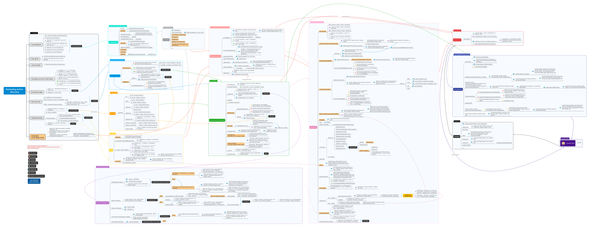
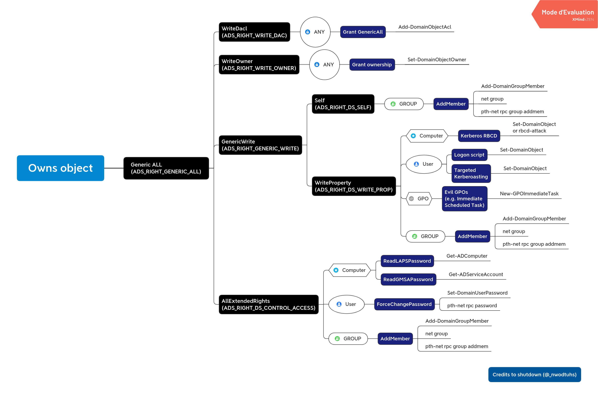

# Arsenal

Arsenal is just a quick inventory, reminder and launcher for pentest commands.
<br>This project written by pentesters for pentesters simplify the use of all the hard-to-remember commands


In arsenal you can search for a command, select one and it's prefilled directly in your terminal. This functionality is independent of the shell used. Indeed arsenal emulates real user input (with TTY arguments and IOCTL) so arsenal works with all shells and your commands will be in the history.

You have to enter arguments if needed, but arsenal supports global variables. <br>
For example, during a pentest we can set the variable `ip` to prefill all commands using an ip with the right one.

To do that you just have to enter the following command in arsenal:
```
>set ip=10.10.10.10
``` 

Authors: 
* Guillaume Muh
* mayfly

This project is inspired by navi (<https://github.com/denisidoro/navi>) because the original version was in bash and too hard to understand to add features

## Launch
```
git clone https://github.com/Orange-Cyberdefense/arsenal.git
cd arsenal
./run
```

Inside your .bashrc or .zshrc add the path to `run` to help you do that you could launch the addalias.sh script
```
./addalias.sh
```

## Install package (not necessary)

```
git clone https://github.com/Orange-Cyberdefense/arsenal.git
cd arsenal
python3 setup.py install
```

## Troubleshooting
If you got on error on color init try : 
```
export TERM='xterm-256color'
```

## Mindmap
- Active directory mindmap


- Exchange Mindmap (thx to @snovvcrash)


- Active directory ACE mindmap


## TODO cheatsheets 

### reverse shell
- [X] msfvenom
- [X] php
- [X] python
- [X] perl
- [X] powershell
- [X] java
- [X] ruby

### whitebox analysis grep regex
- [X] php
- [X] nodejs
- [X] hash

### Tools

#### smb
- [X] enum4linux 
- [X] smbmap
- [ ] smbget     
- [X] rpcclient
- [ ] rpcinfo
- [X] nbtscan
- [X] impacket

#### kerberos & AD
- [X] impacket
- [X] bloodhound

#### MITM
- [X] mitm6
- [X] responder

#### Unserialize
- [X] ysoserial
- [ ] ysoserial.net

### bruteforce & pass cracking
- [X] hydra
- [X] hashcat
- [ ] john

#### scan
- [X] nmap

#### fuzz    
- [X] gobuster
- [X] ffuf
- [X] wfuzz

#### DNS
- [X] dig
- [X] dnsrecon
- [X] dnsenum
- [X] sublist3r

#### rpc
- [ ] rpcbind

#### netbios-ssn
- [X] snmpwalk
- [ ] snmp-check
- [X] onesixtyone

#### sql
- [X] sqlmap 

#### oracle
- [ ] oscanner
- [ ] sqlplus
- [ ] tnscmd10g

#### mysql
- [X] mysql

#### nfs
- [X] showmount

#### rdp
- [X] xfreerdp
- [X] rdesktop
- [ ] ncrack

#### mssql
- [X] sqsh

#### winrm
- [X] evilwinrm

#### redis
- [ ] redis-cli

#### postgres
- [X] psql
- [ ] pgdump

#### vnc
- [X] vncviewer

#### x11
- [X] xspy
- [X] xwd
- [X] xwininfo


#### ldap
- [X] ldapsearch

#### https
- [ ] sslscan

#### web 
- [ ] burp
- [ ] nikto
- [ ] tplmap

#### app web
- [X] drupwn
- [X] wpscan
